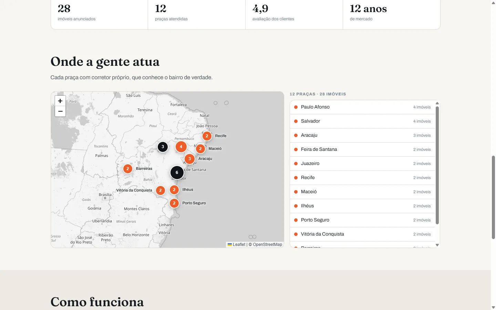
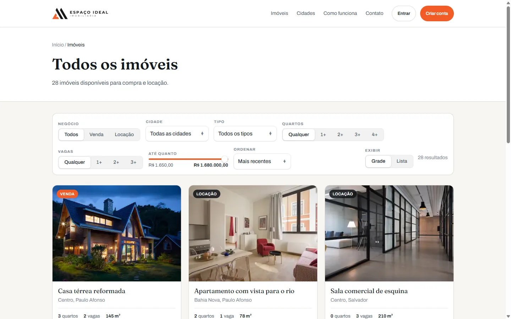
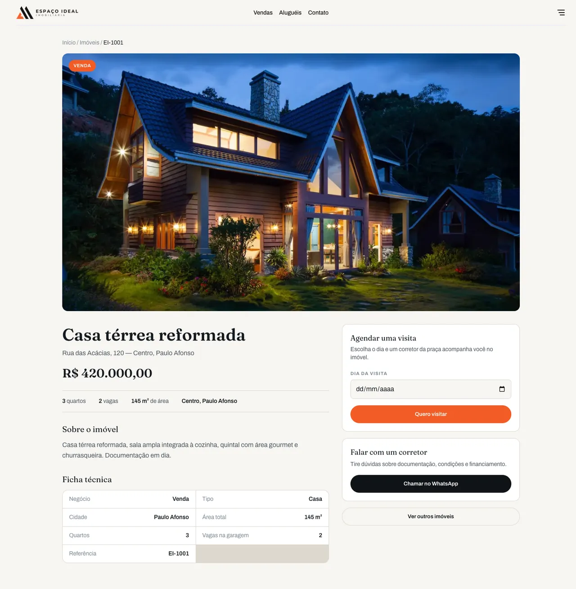
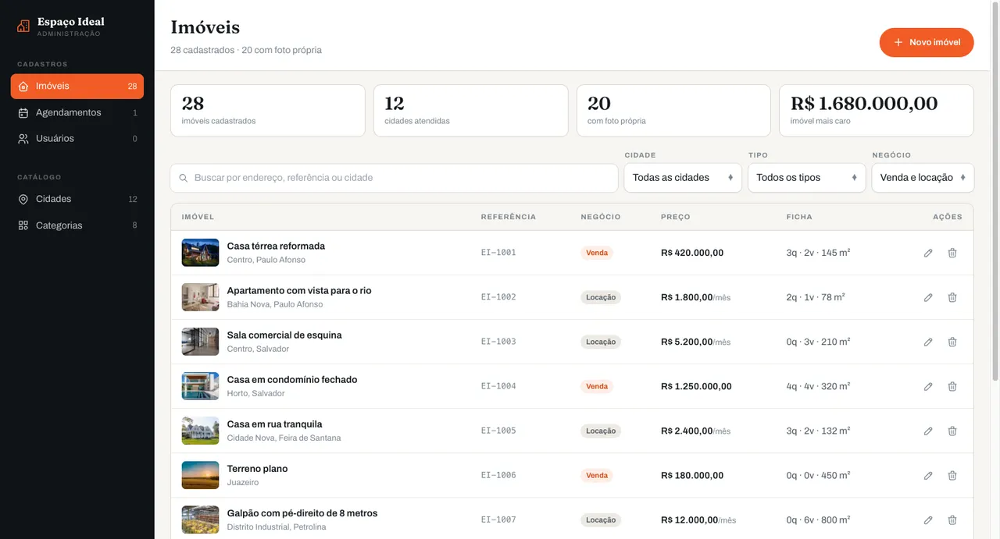
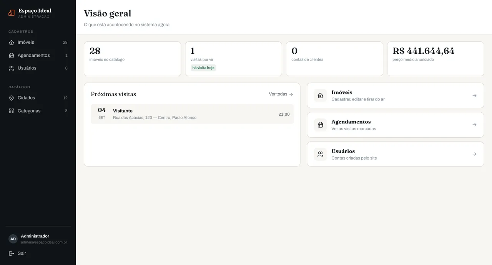

<div align="center">

# Espaço Ideal Imobiliária

**Compra e locação de imóveis** — site público, painel administrativo e API.
Redesign completo e ambiente inteiro em container.


</div>


## Rodando

Precisa apenas de Docker. Nada de Node, Postgres ou Prisma na máquina.

```bash
cp .env.example .env    # preencha as chaves do Firebase
docker compose up -d
```

| Serviço | Endereço              | O que é                        |
| ------- | --------------------- | ------------------------------ |
| Site    | http://localhost:2000 | Next 14 — vitrine de imóveis   |
| Painel  | http://localhost:2001 | Next 14 — administração        |
| API     | http://localhost:2002 | NestJS + Prisma                |
| Banco   | localhost:2005        | PostgreSQL 16                  |

Na primeira subida o backend aplica as migrations e roda o seed sozinho:
12 cidades, 8 categorias, 2 transações e 28 imóveis de exemplo. O seed é
idempotente — rodar de novo não duplica, e atualiza a foto de quem já existe.

O código dos três projetos é montado do host, então editar um arquivo recarrega
o serviço. Detalhes de operação em [COMO-RODAR.md](./COMO-RODAR.md).

## O site

### Landing com globo das praças

A rota `/` apresenta a imobiliária. O globo é [COBE](https://github.com/shuding/cobe)
(5 KB, sem Three.js) e carrega dado real: cada marcador é uma cidade do
catálogo, com a contagem vinda do banco.

Os cards das praças circulam o globo num anel inclinado — quem vem à frente
cresce, quem passa atrás esmaece e sai por trás da esfera. Prendê-los à
coordenada real seria mais fiel e foi descartado com o dado na mão: doze das
catorze praças são do Nordeste e cairiam dentro de cem pixels, virando um
borrão.

### Mapa das praças



A seção "Onde a gente atua" é um mapa [Leaflet](https://leafletjs.com) com os
tiles do OpenStreetMap, dessaturados para o laranja dos pinos ser a única cor
forte. O pino cresce com a carteira da praça, e clicar numa cidade — no mapa
ou na lista ao lado — aproxima até o nível de rua e abre o balão, que leva ao
catálogo já filtrado por aquela cidade.

Juazeiro e Petrolina ficam a 0,03° uma da outra, separadas pelo Rio São
Francisco: no zoom inicial os dois pinos se cobrem. Pinos que chegam perto
demais viram um grupo com a soma e se separam sozinhos ao aproximar — feito à
mão, sem `leaflet.markercluster`, que custaria mais que o problema para doze
praças.

O Leaflet só é baixado quando a seção chega perto da tela, então a abertura da
landing não paga por ele.

### Catálogo



Busca por cidade, tipo, negócio, quartos, vagas e faixa de preço — que se ajusta
ao catálogo, em vez de oferecer um teto inventado. Alterna entre grade e lista
compacta, com paginação de 8.

Os controles são próprios, no vocabulário do macOS: o `<select>` nativo muda de
cara em cada sistema e não aceita ícone nem contagem por opção.

### Detalhe e agendamento



Ficha técnica com valor do m² calculado e agendamento de visita que grava no
banco. Toda tela tem carregamento, erro fiel ao backend e estado vazio que
explica o motivo.

### Entrar e criar conta


Erros do Firebase traduzidos para português — nada de `auth/invalid-credential`
na cara do usuário.

## O painel



Lateral fixa com contagem por seção. A tabela mostra foto, título legível e
preço formatado; busca por endereço, referência ou cidade; filtros e paginação.

O cadastro abre em painel lateral, com máscara de moeda no preço e a lista
visível atrás. Excluir nomeia o registro e pede confirmação.



Agendamentos vêm agrupados por dia, com as visitas de hoje em destaque e link
direto para o imóvel no site.

## Estrutura

```
projeto-espaco-ideal-backend/    NestJS + Prisma + PostgreSQL
projeto-espaco-ideial-frontend/  Next 14 — site público
projeto-espaco-ideial-admin/     Next 14 — painel administrativo
docker-compose.yml               banco, API, site e painel
```

A API tem seis módulos com CRUD fechado: `properties`, `cities`, `categories`,
`transactions`, `users` e `schedules`. O imóvel referencia cidade, categoria e
transação, e as relações vêm incluídas na resposta — sem isso a tela recebe só
ids e não consegue distinguir preço de venda de valor de aluguel.

## Configuração

Tudo o que varia por ambiente está no `.env` (veja `.env.example`): portas,
banco e as duas configurações do Firebase — uma para o projeto dos clientes,
outra para o dos administradores.

> **Sobre as chaves do Firebase:** a chave web é pública por natureza. Ela vai
> para o bundle do navegador, e qualquer visitante consegue lê-la. Tirá-la do
> código organiza o projeto, mas não é medida de segurança. Quem protege os
> dados são as **regras de segurança** do Firestore e do Storage, os **domínios
> autorizados** no Firebase Auth e a **restrição de referenciador** da chave no
> Google Cloud Console.

## Autor

**João Marcos** — Frontend & UI/UX

[Portfólio](https://softwaredeveloper-jmmsp.vercel.app/) ·
[GitHub](https://github.com/Joaommsp) ·
[LinkedIn](https://www.linkedin.com/in/joaomarcos10oficial/)

## Licença

Projeto acadêmico e de portfólio. Imóveis, preços e praças internacionais são
fictícios; as fotos foram geradas por IA.
